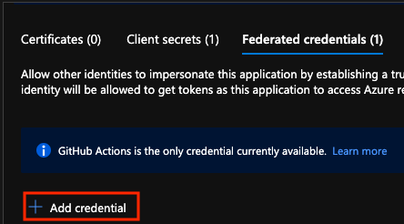

## Authenticating the Terraform Workflow to your Azure Environment
## Setting up GitHub Actions OIDC Authentication 
OpenID Connect (OIDC) allows your GitHub Actions workflows to access resources in Azure, without needing to store the Azure credentials as long-lived GitHub secrets.

## Create an Azure Active Directory Application and Service Principal {.tabset .tabset-pills}
### Azure Portal 
1. If you do not have an existing application, register a new Azure Active Directory application and service principal that can access resources. As part of this process, make sure to:
    * Register your application with Azure AD and create a service principal
    * Assign a role to the application
2. Open App registrations in Azure portal and find your application. Copy the values for Application (client) ID and Directory (tenant) ID to use in your GitHub Actions workflow.
3. Open Subscriptions in Azure portal and find your subscription. Copy the Subscription ID.

### Azure CLI
1. Create the Azure Active Directory application.
    ```
    az ad app create --display-name myApp
    ```
    This command will output JSON with an ```appId``` that is your ```client-id```. The ```objectId``` is ```APPLICATION-OBJECT-ID``` and it will be used for creating federated credentials with Graph API calls.
2. Create a service principal. Replace ```$appIdD``` with the appId from your JSON output. This command generates JSON output with a different ```objectId``` will be used in the next step. The new ```objectId``` is the ```assignee-object-id```.
    ```
    az ad sp create --id $appId
    ```
3. Create a new role assignment by subscription and object. By default, the role assignment will be tied to your default subscription. Replace ```$subscriptionId``` with your subscription ID, ```$resourceGroupName``` with your resource group name, and ```$assigneeObjectId``` with generated ```assignee-object-id``` (the newly created service principal object id).

    ```
    az role assignment create --role contributor --subscription $subscriptionId --assignee-object-id  $assigneeObjectId --assignee-principal-type ServicePrincipal --scope /subscriptions/$subscriptionId/resourceGroups/$resourceGroupName
    ```

### Azure PowerShell
1. Create the Azure Active Directory application.

    ```powershell
    New-AzADApplication -DisplayName myApp
    ```
    This command will output the ```AppId``` property that is your ```ClientId```. The ```Id``` property is ```APPLICATION-OBJECT-ID``` and it will be used for creating federated credentials with Graph API calls.
2. Create a service principal. Replace the ```$clientId``` with the AppId from your output. This command generates output with a different ```Id``` and will be used in the next step. The new ```Id``` is the ```objectId```.

    ```powershell
    $clientId = (Get-AzADApplication -DisplayName myApp).AppId
    New-AzADServicePrincipal -ApplicationId $clientId
    ```
3. Create a new role assignment. Beggining with Az PowerShell module version 7.x, ```New-AzAdServicePrincipal``` no longer assigned the contributor role to the service principal by default. Replace ```$resourceGroupName``` with your resource group name, and ```$objectId``` with the generated ```Id```.

    ```powershell
    $objectId = (Get-AzADServicePrincipal -DisplayName myApp).Id
    New-AzRoleAssignment -ObjectId $objectId -RoleDefinitionName Contributor -ResourceGroupName $resourceGroupName
    ```
4. Get the values for ```clientId```, ```subscriptionId```, and ```tenantId``` to use later in your GitHub Actions workflow.

    ```powershell
    $clientId = (Get-AzADApplication -DisplayName myApp).AppId
    $subscriptionId = (Get-AzContext).Subscription.Id
    $tenantId = (Get-AzContext).Subscription.TenantId
    ```
    ##

## Add Federated Credentials {.tabset .tabset-pills}
You can add federated credentials in the Azure portal or with the Microsoft Graph REST API.

### Azure Portal
1. Go to App registrations in the [Azure portal](https://portal.azure.com/) and open the app you want to configure.
2. Within the app, go to **Certificates and Secrets.**

    
3. In the **Federated credentials** tab, select **Add credential**.

    

4. Select the credential scenario **Github Actions deploying Azure resources.** Generate your credential by entering your credential details.

    | Field | Description | Example |
    |:------|:--------------|:-----------|
    | Organization | Your GitHub organization name or GitHub username. | ```contoso```|
    | Repository | Your GitHub Repository name. | ```contoso-app```|
    | Entity type | The filter used to scope the OIDC requests from GitHub workflows. This field is used to generate the ```subject``` claim. | ```Environment```, ```Branch```, ```Pull request```, ```Tag```|
    | GitHub name | The name of the environment, branch, or tag. | ```main``` |
    | Name | The identifier for the federated credential. | ```contoso-deploy``` |

    For a more detailed overview, see [Configure an app to trust a GitHub repo.](https://learn.microsoft.com/en-us/azure/active-directory/develop/workload-identity-federation-create-trust-github)

### Azure CLI
1. Run the following command to [create a new federated identity credential](https://learn.microsoft.com/en-us/azure/active-directory/workload-identities/workload-identity-federation-create-trust?pivots=identity-wif-apps-methods-azcli) for your Azure Active Directory  application.

    * Replace ```APPLICATION-OBJECT-ID``` with the ```objectId``` **(generated while creating app)** for your Azure Active Directory application.
    * Set a value for the ```CREDENTIAL-NAME``` to reference later.
    * Set the ```subject```. The value of this is defined by GitHub depending on your workflow:
        
        * Jobs in your GitHub Actions environment: ```repo:<Organization/Repository>:environment:<Name>```
        * For jobs not tied to an environment, include the ref path for your branch/tag based on the ref path used for triggering the workflow: ```repo:<Organization/Repository>:ref:< ref path >```. For example, ```repo:n-username/node_express:ref:refs/head/my-branch``` or ```repo:n-username/ node_express:ref:refs/tags/my-tag```. 
        * For workflows triggered by a pull request event: ```repo:<Organization/Repository>:pull_request```.

            ```
            az ad app federated-credential create --id <APPLICATION-OBJECT-ID> --parameters credential.json
            ("credential.json" contains the following content)
            {
                "name": "<CREDENTIAL-NAME>",
                "issuer": "https://token.actions.githubusercontent.com",
                "subject": "repo:octo-org/octo-repo:environment:Production",
                "description": "Testing",
                "audiences": [
                    "api://AzureADTokenExchange"
                ]
            }
            ```

        For a more detailed overview, see [Configure an app to trust an external identity provider.](https://learn.microsoft.com/en-us/azure/active-directory/develop/workload-identity-federation-create-trust-github)

### Azure PowerShell

Run New-AzADAppFederatedCredential cmdlet to create a new federated identity credential for your Azure Active Directory application.
    
* Replace APPLICATION-OBJECT-ID with the Id (generated while creating app) for your Azure Active Directory application.
* Set a value for CREDENTIAL-NAME to reference later.
* Set the subject. The value of this is defined by GitHub depending on your workflow:
    * Jobs in your GitHub Actions environment: ```repo:< Organization/Repository >:environment:< Name >```
    * For Jobs not tied to an environment, include the ref path for branch/tag based on the ref path used for triggering the workflow: ```repo:< Organization/Repository >:ref:< ref path>```. For example, r```epo:n-username/ node_express:ref:refs/heads/my-branch``` or ```repo:n-username/ node_express:ref:refs/tags/my-tag```.
     * For workflows triggered by a pull request event: repo:```< Organization/Repository >:pull_request```.

```powershell
New-AzADAppFederatedCredential -ApplicationObjectId APPLICATION-OBJECT-ID -Audience api://AzureADTokenExchange -Issuer 'https://token.actions.githubusercontent.com/' -Name 'GitHub-Actions-Test' -Subject 'repo:octo-org/octo-repo:environment:Production'
```

For a more detailed overview, see[ Configure an app to trust a GitHub repo](https://learn.microsoft.com/en-us/azure/active-directory/workload-identities/workload-identity-federation-create-trust?pivots=identity-wif-apps-methods-powershell).


## Create GitHub secrets

You need to provide your application's Client ID, Tenant ID and Subscription ID to the login action. These values can either be provided directly in the workflow or can be stored in GitHub secrets and referenced in your workflow. Saving the values as GitHub secrets is the more secure option.

1. Open your GitHub repository and go to **Settings.**

    

2. Select **Security > Secrets and Variables > Actions**.

    

3. Create secrets for ```AZURE_CLIENT_ID```, ```AZURE_TENANT_ID```, and ```AZURE_SUBSCRIPTION_ID.``` Use these values from your Azure Active Directory application for your GitHub secrets:

    | GitHub Secret |	Azure Active Directory Application |
    |:---|:---|
    | AZURE_CLIENT_ID |	Application (client) ID |
    | AZURE_TENANT_ID |	Directory (tenant) ID |
    | AZURE_SUBSCRIPTION_ID | 	Subscription ID |

4. Save each secret by selecting **Add secret**.

##

## Set up Azure Login with OpenID Connect authentication {.tabset .tabset-pills}
Your GitHub Actions workflow uses OpenID Connect to authenticate with Azure. To learn more about this interaction, see the [GitHub Actions documentation](https://docs.github.com/actions/deployment/security-hardening-your-deployments/configuring-openid-connect-in-azure).

In this example, you'll use OpenID Connect Azure CLI to authenticate with Azure with the [Azure login action](https://github.com/marketplace/actions/azure-login). The example uses GitHub secrets for the ```client-id```, ```tenant-id```, and ```subscription-id values```. You can also pass these values directly in the login action.

The Azure login action includes an optional ```audience``` input parameter that defaults to ```api://AzureADTokenExchange```. You can update this parameter for custom audience values.

### Linux

This workflow authenticates with OpenID Connect and uses Azure CLI to get the details of the connected subscription and list resource group.

```yaml
name: Run Azure Login with OpenID Connect
on: [push]

permissions:
      id-token: write
      contents: read
      
jobs: 
  build-and-deploy:
    runs-on: ubuntu-latest
    steps:
    - name: 'Az CLI login'
      uses: azure/login@v1
      with:
          client-id: ${{ secrets.AZURE_CLIENT_ID }}
          tenant-id: ${{ secrets.AZURE_TENANT_ID }}
          subscription-id: ${{ secrets.AZURE_SUBSCRIPTION_ID }}
  
    - name: 'Run Azure CLI commands'
      run: |
          az account show
          az group list
          pwd
```

### Windows
This workflow authenticates with OpenID Connect and uses PowerShell to output a list of resource groups tied to the connected Azure subscription.

```yaml
name: Run Azure Login with OpenID Connect and PowerShell
on: [push]

permissions:
      id-token: write
      contents: read
      
jobs: 
  Windows-latest:
      runs-on: windows-latest
      steps:
        - name: OIDC Login to Azure Public Cloud with AzPowershell (enableAzPSSession true)
          uses: azure/login@v1
          with:
            client-id: ${{ secrets.AZURE_CLIENT_ID }}
            tenant-id: ${{ secrets.AZURE_TENANT_ID }}
            subscription-id: ${{ secrets.AZURE_SUBSCRIPTION_ID }} 
            enable-AzPSSession: true

        - name: 'Get resource group with PowerShell action'
          uses: azure/powershell@v1
          with:
             inlineScript: |
               Get-AzResourceGroup
             azPSVersion: "latest"
```

## Verify successful Azure Login with OpenID

Open the ```Az CLI login``` action and verify that it ran successfully. You should see the message ```Login successful```. If your login is unsuccessful, you'll see the message ```Az CLI Login failed.```.


