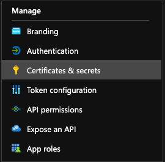
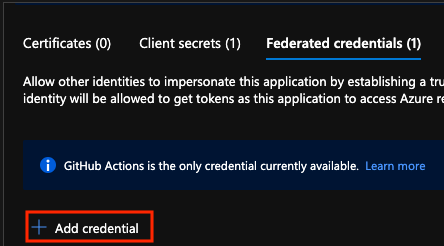

# Setting up GitHub Actions OIDC Authentication
OpenID Connect (OIDC) allows your GitHub Actions workflows to access resources in Azure, without needing to store the Azure credentials as long-lived GitHub secrets.

## Create an Azure Active Directory Application and Service Principal {.tabset .tabset-pills}
### Azure Portal
If you do not have an existing application, register a new Azure Active Directory application and service principal that can access resources. As part of this process, make sure to:

Register your application with Azure AD and create a service principal
Assign a role to the application
Open App registrations in Azure portal and find your application. Copy the values for Application (client) ID and Directory (tenant) ID to use in your GitHub Actions workflow.

Open Subscriptions in Azure portal and find your subscription. Copy the Subscription ID.

### Azure CLI
1. Create the Azure Active Directory application.

    ```
    az ad app create 
    ```
    This command will output JSON with an appId that is your client-id. The objectId is APPLICATION-OBJECT-ID and it will be used for creating federated credentials with Graph API calls.

2. Create a service principal. Replace the $appID with the appId from your JSON output. This command generates JSON output with a different objectId will be used in the next step. The new objectId is the assignee-object-id.

    ```
    az ad sp create --id $appId
    ```

3. Create a new role assignment by subscription and object. By default, the role assignment will be tied to your default subscription. Replace $subscriptionId with your subscription ID, $resourceGroupName with your resource group name, and $assigneeObjectId with generated assignee-object-id (the newly created service principal object id).

    ```
    az role assignment create --role contributor --subscription $subscriptionId --assignee-object-id  $assigneeObjectId --assignee-principal-type ServicePrincipal --scope /subscriptions/$subscriptionId/resourceGroups/$resourceGroupName
    ```

4. Copy the values for clientId, subscriptionId, and tenantId to use later in your GitHub Actions workflow.

# Add federated credentials {.tabset .tabset-pills}
## Azure Portal
1. Go to App registrations in the Azure portal and open the app you want to configure.
2. Within the app, go to Certificates and secrets.

    

3. In the Federated credentials tab, select Add credential. Add the federated credential

    

4. Select the credential scenario GitHub Actions deploying Azure resources. Generate your credential by entering your credential details.

    | **Field** | **Description** | **Example** |
    |------| -------------|-----------|
    | Organization  | Your GitHub organization name or GitHub username. | ```contoso``` |
    | Repository | Your GitHub Repository name. | ```contoso-app```|
    | Entity type | The filter used to scope the OIDC requests from GitHub workflows. This field used to generate the ```subject``` claim. | ```Environment```, ```Branch```, ```Pull Request```,```Tag```|
    |GitHub Name | The name of the environment, branch, or tag. | ```main```|
    |Name | Identifier for the federated Credential | ```contoso-deploy```|
    
    For a more detailed overview, see Configure an app to trust a GitHub repo.
##
